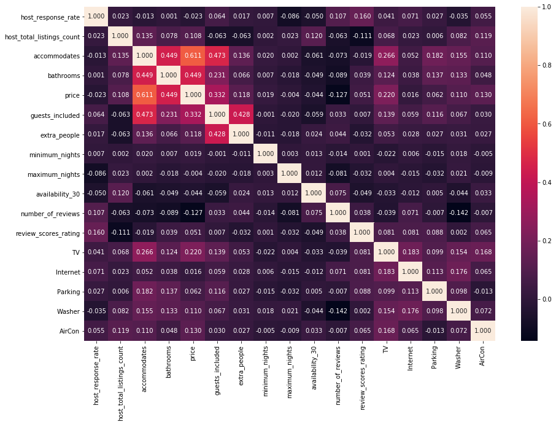
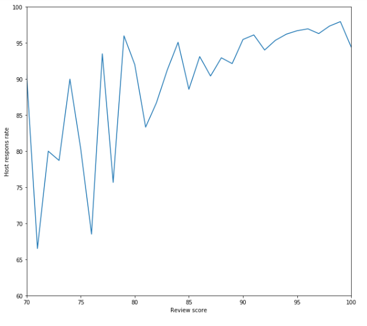

## AirBnB

### What do you want to know before entering the Airbnb business?

Airbnb market is growing for past few years, and more and more visitors choose it while travelling all over the world. Owning an property and renting it on the market helps creating potential opportunies on small business.

This post will take a look at the Airbnb history data in Seattle and try to provide some information on how to build your Airbnb business by analyzing the datas.

Before we step into Airbnb business, following questions would help us running this business more easier:

- How to achieve the best price?
- How to achieve good reviews?
- Can a machine learning algorithm predict listing prices?

### Summary Of The Results

- Question 1: How to achieve the best price?

    From the correlation matrix below we can immediately see which parameters correlate most with the price. The number of people that the list can include is the most significant factor, but amenities are also key.

    

    In fact, the relationship between housing and pricing is linear , showing how important it is to manage more people if you want a good price.

    Location is also important when it comes to pricing. According to Seattle statistics, the most expensive area (Magnolia) was twice as expensive as the lowest cost area (Dellridge).

- Question 2 :How to achieve good reviews?

    From the heat map above we can see that the most important factor in getting good reviews is to respond to all the guests' requests, which is not too surprising.

    

    There is a small correlation between bathrooms, price and review score. This might be due to standard. Higher standard listings gets better reviews. limitations on maximum nights are bad for review score and availablity is also relevant.

- Question 3 : Can a machine learning algorithm predict listing prices?

    I experimented with three different machine learning algorithms for this analysis: Support vector machines, AdaBoost and RandomForest.

- Conclusion :

    In the end, Random forest turned ut to be the most accurate machine learning algorithm for this task with an R2-score of 0.53, meaning that the model can explain 53% of the price. The dataset contained little information about standard besides amenities, and I belive that a substantial amount of the remaining unexplained variance of price is related to standard.

### Acknowledgements, etc.

Credit to the AirBnB dataset published by AirBnB and Kaggle for hosting it, the dataset here: https://www.kaggle.com/airbnb/seattle

Heatmap reference: https://stackoverflow.com/questions/12286607/making-heatmap-from-pandas-dataframe